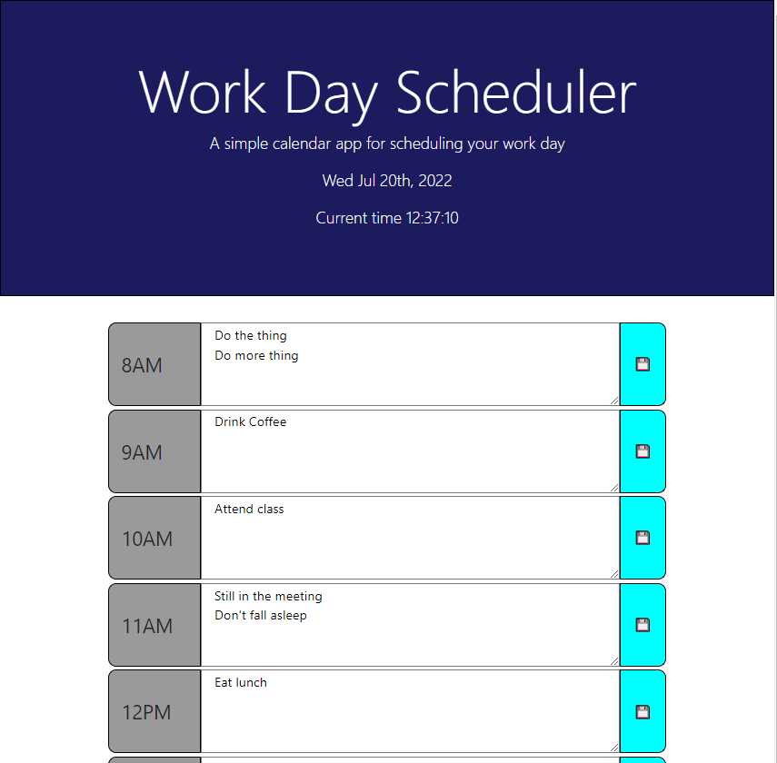
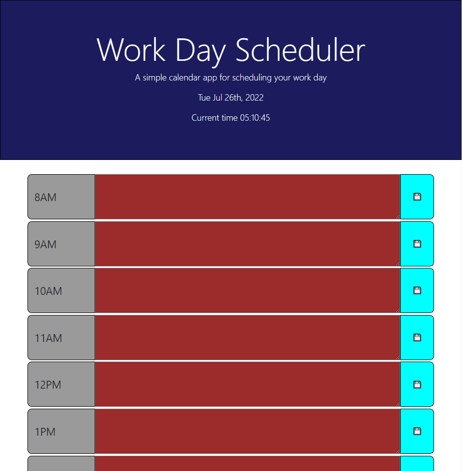
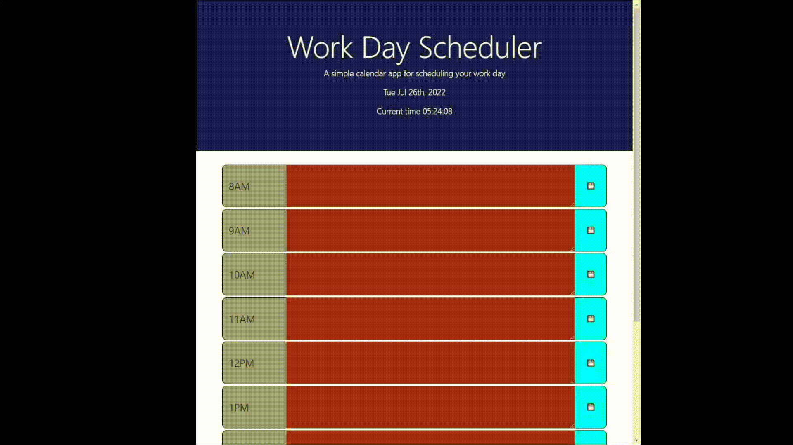

# Work Day Planner (Using Momentjs)

By Vincent Yang

## This work day planner uses Momentjs for a variety of functions: 
* Displaying the date and time in the jumbotron banner.
* The textareas for the current time and future time blocks will display in **WHITE** while the textarea blocks change color to **RED** if the row time has passed.
* Clicking the save icon at the right of the row will store any text value in the text area to the left to local storage.
* Any values saved to local storage will load into their respective text areas when the webpage is reloaded.

>Initial Landing Page
 

>Time blocks change to red when the time has passed
 

>Saved tasks load to their respective time blocks from local storage after the website reloads
 

https://github.com/vyang14/work-day-planner-momentjs

https://vyang14.github.io/work-day-planner-momentjs/